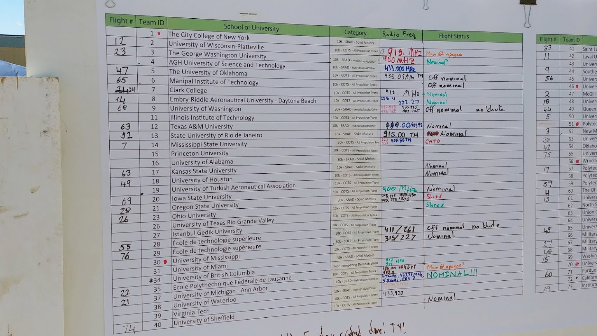
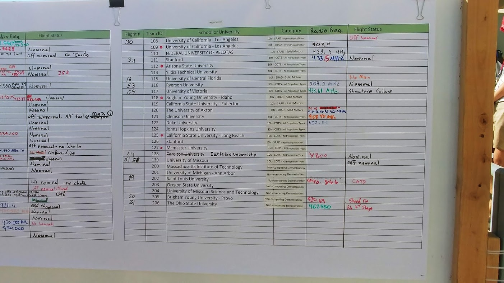

# SPEXTRO Scientific Payload
## SDL Payload Challenge - IREC 2019

### Revision History
| Revision | Date | Author(s) | Description |
| --- | --- | --- | --- |
| 1 | 9/14/2018 | Daniel Mitchell, Dylan Wager, Luc Chartier | Initialized Document - Created Structure |
| 2 | 7/30/2019 | Daniel Mitchell, Dylan Wagner, Matthew Glazer, Austin Heisey, James Parkus | Filled out the rest of the requirements, moving to high-level design next (major component selection) |

-----
### Backup Scientific Objectives
* Radar Altimeter
* Parachute-controlled descent to pre-determined GPS coordinates

### Scientific Objectives (Protein Spectroscopy)
 * Observe the effective folding behavior of proteins under different G-conditions when mixed with saline & excited
 * Excite w/ 280nm -> Expect response at 350nm

---
### Scientific Experiment Interface & Support
 * Mix of proteins (powder) and a liquid saline
    * Interface with microfluidic systems (valves, solenoids, etc.)
    * Multiple experiments in a mission????
 * Excite the mixture w/ 280nm wavelength (diode)
 * Filter (bandgap) the response from the mixture
 * Sense the magnitude of the response from the mixture (UV photodiode)
    * Small-signal supporting circuitry???

---
### Power
* At least 24 hours of runtime
* __ watts instantaneously (TBD)
* Redundant battery option
* Reverse polarity protection (Should be using keyed connectors anyway)
* Thermal protection (usually built in the regulators)
* Parallel regulators (redundancy)
* Physical switch to enable power
* Physical switch does not disable power (MCU takes over)
* High efficiency is desireable for runtime

---
### Communication
* Frequencies selected to avoid commonly-used other frequencies (See frequency chart images below from IREC 2018)

* Redundant location transmission (standalone APRS?)
* Stretch: Video transmission (separate channel?)
* Discrete Tx and Rx radios (full duplex!!!)
* \>=500mW transmission power
* 10Kbit/s (with factor of safety) [Spitballed]

Note: Table below are very rough estimations - needs closer look
| Data | Rate (Hz) | Size (Bytes) | Bits/sec | Phase |
| - | - | - | - | - |
| Pitch/Roll/Yaw | 20 | 4 | 640 | UKN |
| Altitude | 5 | 2 | 80 | Main |
| GPS | 5 | 8 | 320 | Main, Science |
| Accel x/y/z | 5 | 3 | 104 | Unarmed |
| Science | 100 | 2 | 800 | Science |
| Status | 5 | 2 | 80 | Unarmed |
Continued...

---
### Data Acquisition
* Acceleration
* Gyro 
* Magnetometer (heading)
* Altitude (Barometric + other?)
* Temperature
* GPS (lat, lon, alt)
* Scientific Payload data
* Payload health (battery status, voltage/current, etc.)
* Stored to nonvolatile memory

Continued...

* *Stretch Goal:* Video Streaming

---
### Actuation
* Parachute deployment from PCB
* Redundant parachute deployment - COTS module?
* Scientific Mixing

---

### Tracking/Recovery
* Redundant frequency for tracking
* Buzzer (only on when GND station command is received)
* Bright LEDs (only on when GND station command is received)
* Bright parachute (pink/purple may be best for the desert w/ shrub)
* Cut parachute capabilities? (Geofencing - doesn't blow away)
* Separate GND station for location receiving and communication

---

### Computing Resources
* Watchdog Timer for power reset
* Nonvolatile memory - state storage

---

### Software
* Flight: FreeRTOS
* GND Station: Linux

---

### Size/Weight
* Cubesat standard
* 3U required when deploying
* 8.8lbs Minimum (still a requirement????)

---

### Structure
* RF Transparent
* Structurally rigid
* Components easily mountable inside
* Access internals with minimal effort
    * Hinged side panels???
* Antennas not too close to metal frame
    * Would like an RF analysis here to prove out
* GPS antenna facing upward
* Parachute opening comes out the top
    * Dylan recommends gluing GPS antenna to parachute
        * Dylan knows nothing about antennas
* CG opposite of parachute (floor of payload)
---

### Rocket Interface(s)
* Deployment detection (sabot switches again?)
* Rocket armed detection? (may require coms interface to rocket)
---

### Ground Station
* Real-time updates from rocket/payload during mission
    * Records all data received to non-volatile memory
* Mobile & compact
* Resistant to the heat and dust
* Directional receiver for additional range
* Can communicate back to payload (sound-off command)
* Knows own location to derive required bearing for recovery
---

### Environmental Protection
* High temps ~60C can be expected
* Conformal coating should be used for electronics
* Surface mount components for vibration resistance
* Are we going to need thermal dissipation from electronics?
---
